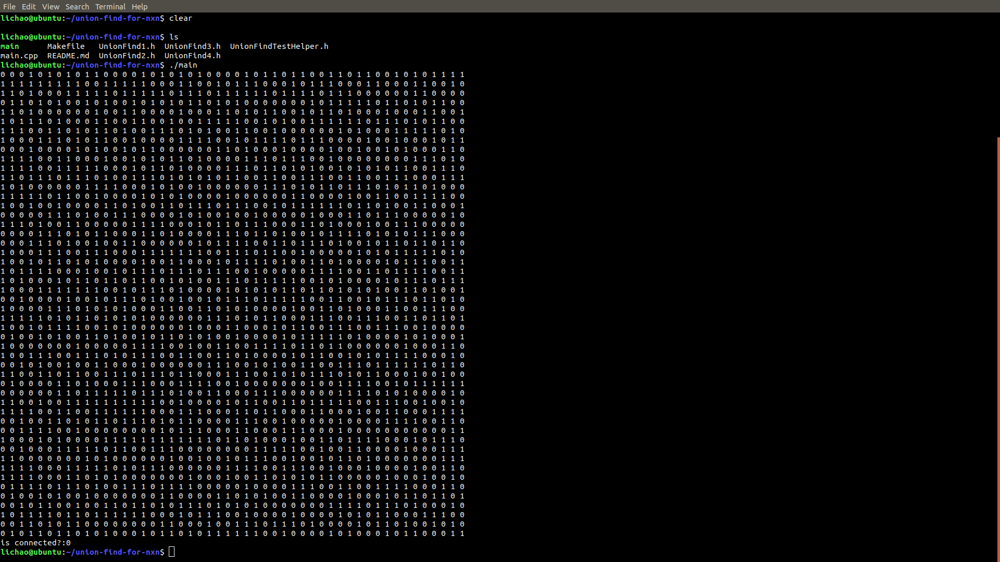

# union-find-for-nxn
Using union search set to solve the problem whether the path is interlinked or not
## 随机生成一个n * n方格, 任意选择两个点, 判定路径是否相通
## 设计思路：
         考察方格中每一个元素的上下左右元素关系，构造并查集, 根据并查集确认是否相连通。

